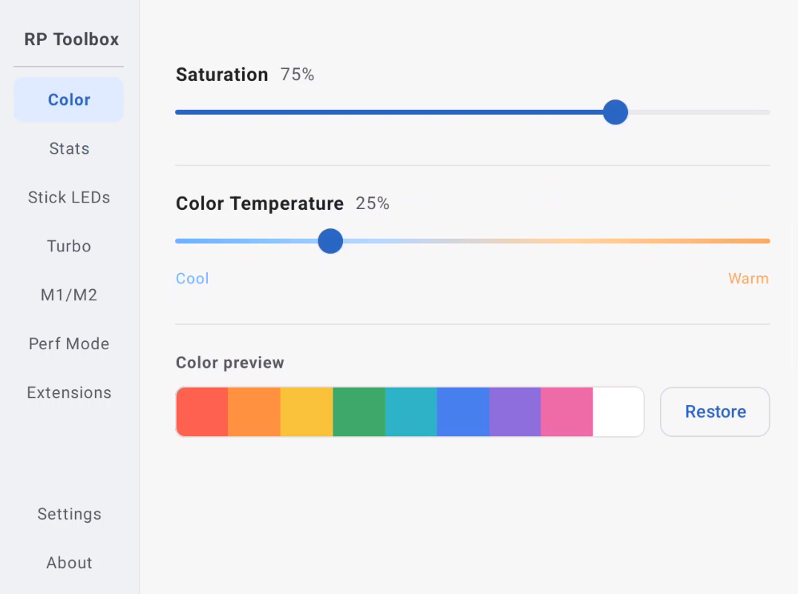
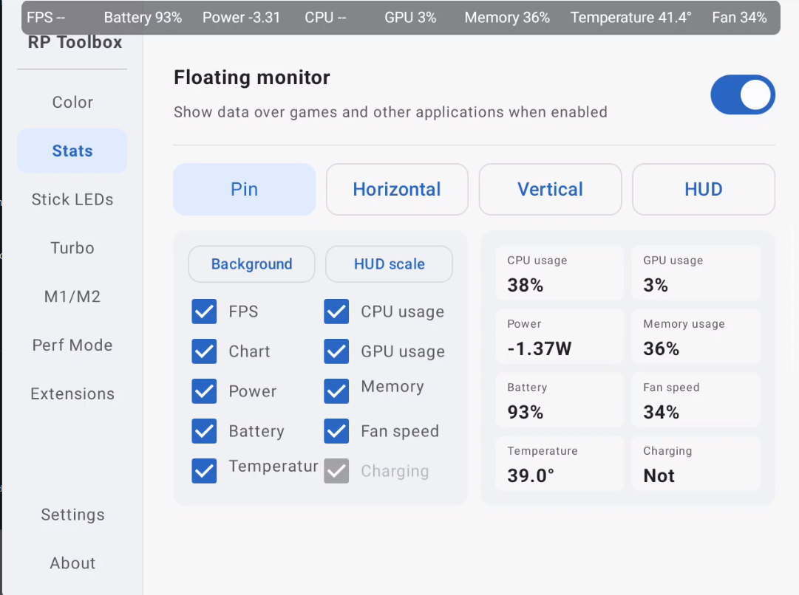
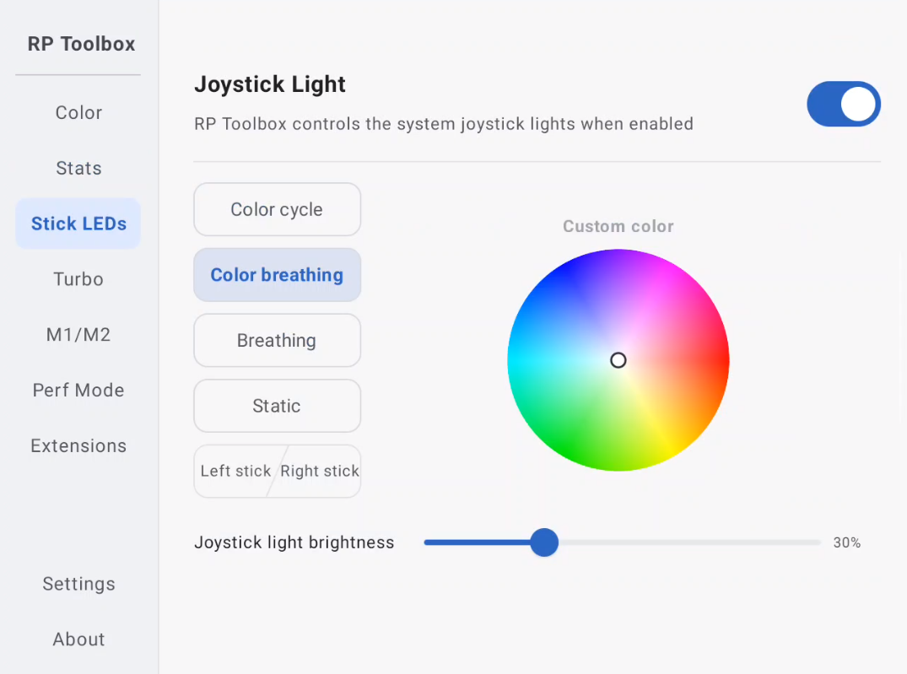
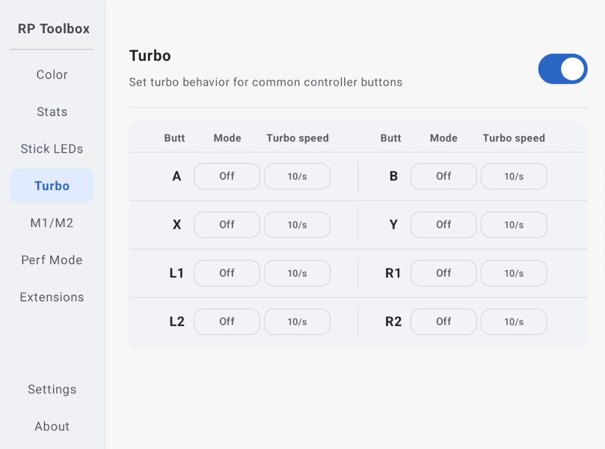
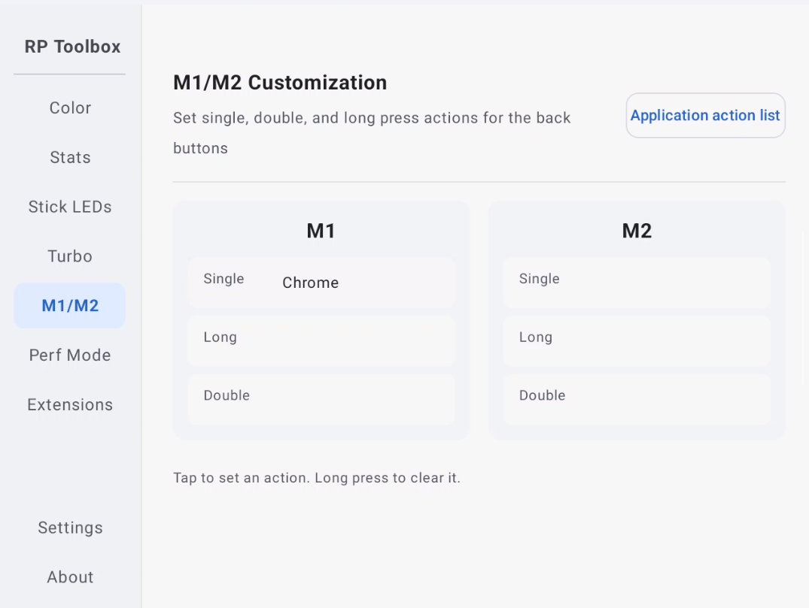
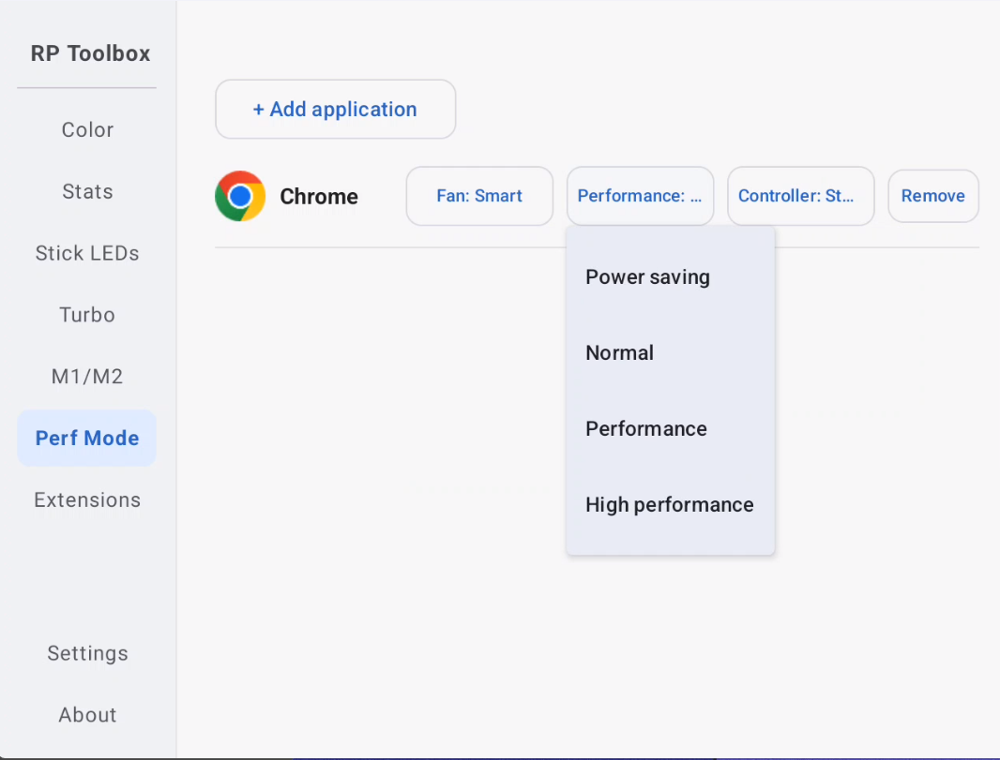
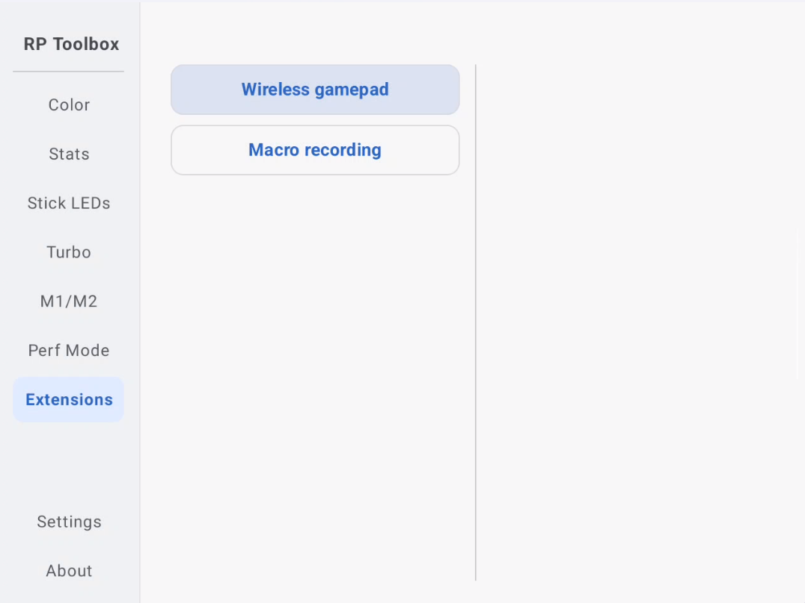
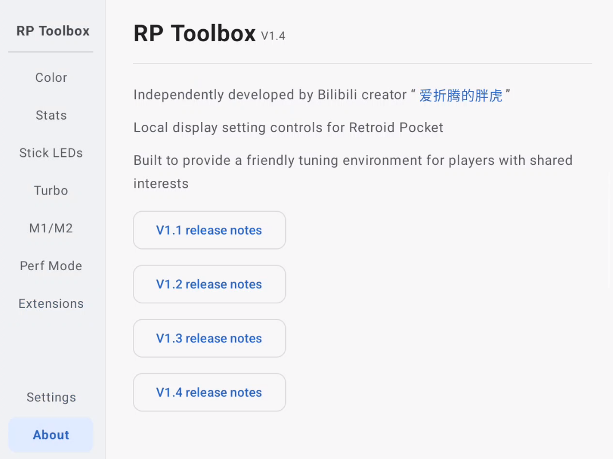
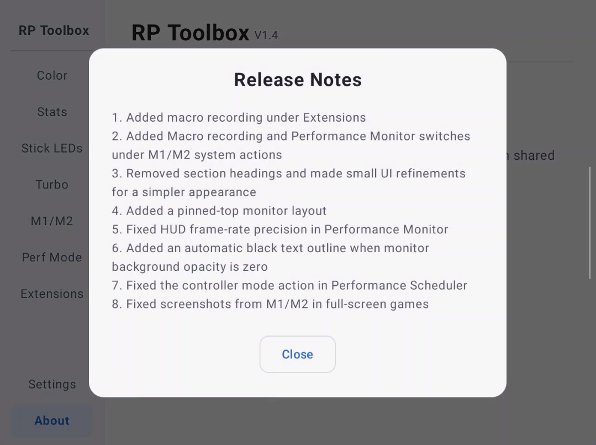

# RP Toolbox

A free utility app for the Retroid Pocket Nova and RP6.

## Download

Download the latest APK from the [Releases page](https://github.com/GuanRen-Panghu/RP-Toolbox/releases).

## About

RP Toolbox adds useful controls and quality-of-life features without making the device feel cluttered.

## Features

- Adjust screen saturation and color temperature
- System monitoring overlay
- Extra lighting effects
- Controller turbo / rapid-fire
- More M1/M2 options
- Performance controls
- Use the handheld as a wireless PC gamepad with a companion PC app
- Android macro recording

## What's New in v1.4

1. Added macro recording under Extensions.
2. Added Macro recording and Performance Monitor switches under M1/M2 system actions.
3. Removed section headings and made small UI refinements for a simpler appearance.
4. Added a pinned-top monitor layout.
5. Fixed HUD frame-rate precision in Performance Monitor.
6. Added an automatic black text outline when monitor background opacity is zero.
7. Fixed the controller mode action in Performance Scheduler.
8. Fixed screenshots from M1/M2 in full-screen games.

## Screenshots

  
  
  

  
  
  

  
  
  

## Feedback

Feedback and feature suggestions are welcome.
